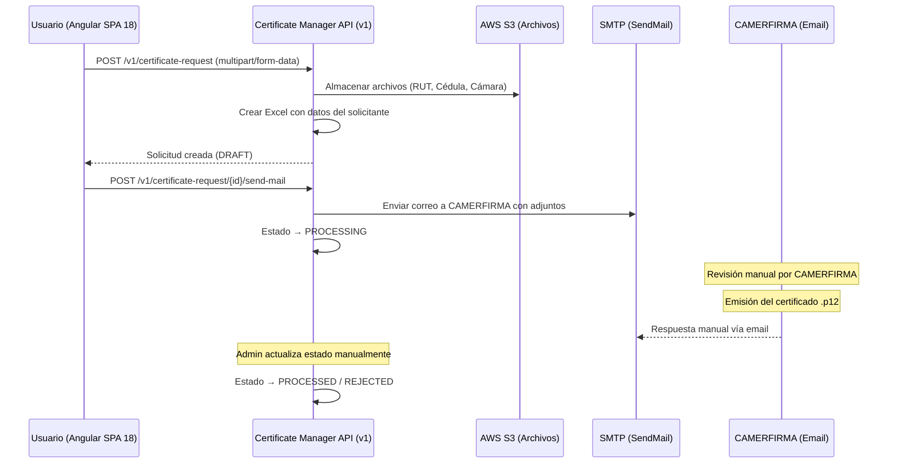
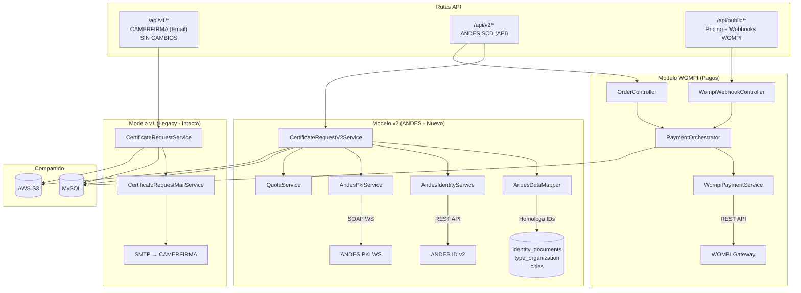
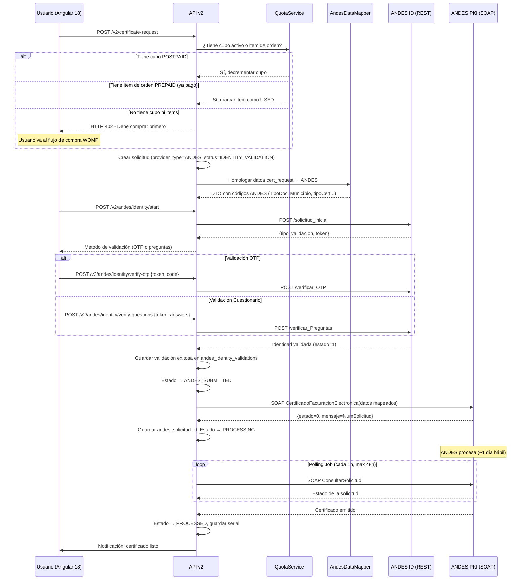
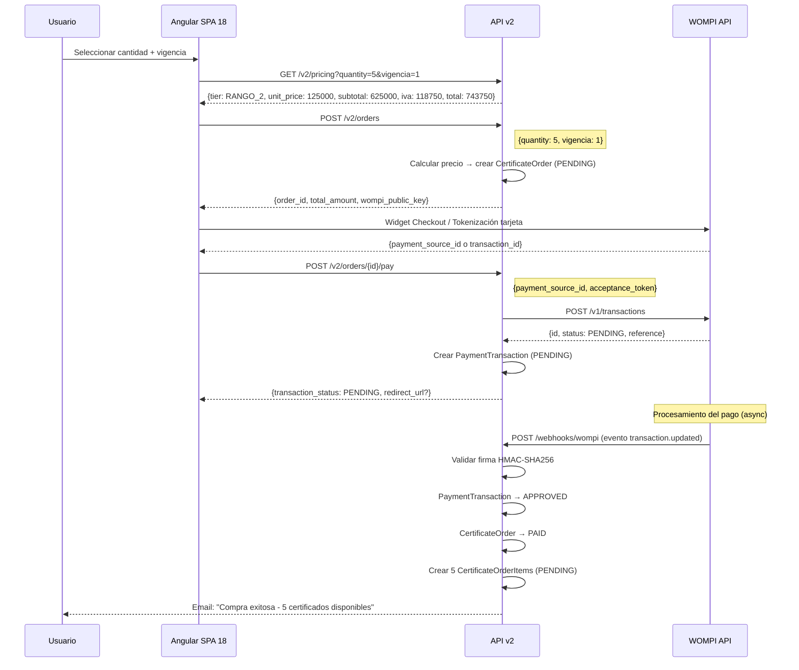
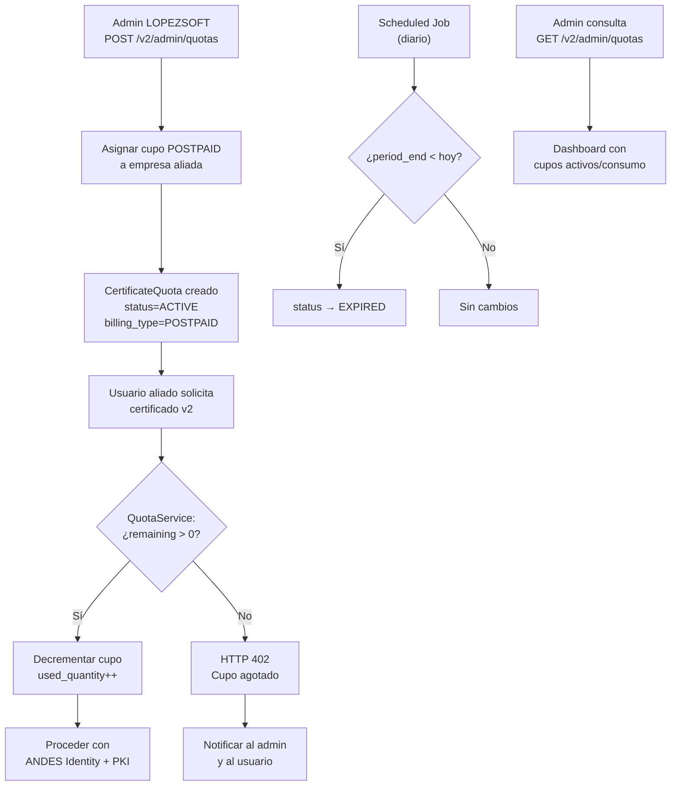

# Plan de Implementación v2: Integración ANDES SCD + WOMPI + Sistema de Cupos

> [!CAUTION]
> **POLÍTICA DE SEGURIDAD DE BASE DE DATOS — REGLA INQUEBRANTABLE**
>
> **NUNCA** ejecutar `php artisan migrate` ni `php artisan migrate:fresh` ni `php artisan migrate:reset`.
> Estos comandos pueden **DESTRUIR TODA LA DATA EXISTENTE EN PRODUCCIÓN**.
>
> **Protocolo obligatorio de ejecución de migraciones:**
> 1. Cada migración se ejecuta **individualmente** usando su ruta completa:
>    ```bash
>    php artisan migrate --path=database/migrations/2026_04_21_000001_add_andes_code_to_identity_documents.php
>    ```
> 2. Las migraciones ALTER son **solo aditivas** (ADD COLUMN). Nunca DROP COLUMN, RENAME TABLE, ni TRUNCATE.
> 3. Las migraciones CREATE son **solo tablas nuevas**. Nunca modifican tablas existentes.
> 4. Antes de ejecutar cualquier migración, se verifica manualmente la SQL generada.
> 5. En caso de rollback, los métodos `down()` solo eliminan lo que el `up()` creó, nunca datos preexistentes.

> [!NOTE]
> Versión actualizada con homologación de tablas existentes, política de migraciones seguras y resolución de todas las preguntas abiertas.

---

## 1. Contexto y Estado Actual

### 1.1 Modelo Actual (CAMERFIRMA vía Email)

El sistema opera con un flujo **manual basado en correo electrónico**:



**Archivos clave del flujo actual:**

| Archivo | Responsabilidad |
|---------|----------------|
| [CertificateRequestController.php](file:///d:/wamp64/www/certificate-manager/backend/app/Http/Controllers/CertificateRequestController.php) | Controlador REST con Swagger docs |
| [CertificateRequestService.php](file:///d:/wamp64/www/certificate-manager/backend/app/Services/CertificateRequestService.php) | CQRS: handlers para escritura, queries directas para lectura |
| [CertificateRequestMailService.php](file:///d:/wamp64/www/certificate-manager/backend/app/Services/CertificateRequestMailService.php) | Envío de email a CAMERFIRMA con adjuntos |
| [CreateCertificateRequestHandler.php](file:///d:/wamp64/www/certificate-manager/backend/app/Handlers/Certificate/CreateCertificateRequestHandler.php) | Command Pattern: validación + Excel + S3 + eventos |
| [UpdateCertificateStatusHandler.php](file:///d:/wamp64/www/certificate-manager/backend/app/Handlers/Certificate/UpdateCertificateStatusHandler.php) | Cambio de estado + historial + notificaciones |
| [CertificateRequestStatusEnum.php](file:///d:/wamp64/www/certificate-manager/backend/app/Enums/CertificateRequestStatusEnum.php) | Enum: DRAFT→SENT→PENDING→ACCEPTED→PROCESSING→PROCESSED→REJECTED |

### 1.2 Stack Tecnológico

| Componente | Tecnología |
|-----------|-----------|
| **Backend** | Laravel 10.x (PHP 8.1+) |
| **Frontend** | Angular SPA 18 |
| Auth | Laravel Passport (OAuth2) |
| Almacenamiento | AWS S3 |
| Base de datos | MySQL |
| Cola | Laravel Queue (configurable) |
| AI/OCR | AWS Textract + Google Vision + Gemini |
| Webhooks | Sistema propio (endpoints + deliveries) |
| Documentación | L5-Swagger (OpenAPI) |
| Despliegue | Servidor dedicado (sin Docker, extensiones PHP activas) |

### 1.3 Patrones Arquitectónicos Existentes

- **Command Pattern**: `Commands/Certificate/` + `Handlers/Certificate/`
- **Service Layer**: `Services/` como capa de orquestación
- **Event-Driven**: Eventos de dominio → Listeners → Webhooks
- **Repository Pattern** (parcial): `Webhooks/Repositories/`
- **Contracts/Interfaces**: `Interfaces/`, `Webhooks/Contracts/`
- **DTOs**: `DTOs/` para transferencia de datos

---

## 2. Análisis de la Documentación ANDES SCD

### 2.1 ANDES ID – API REST (Verificación de Identidad)

**Base URL**: `https://v2.andesid.com.co/api`
**Autenticación**: OAuth2 (Laravel Passport) – Bearer Token (1h TTL)

| # | Endpoint | Método | Descripción |
|---|----------|--------|-------------|
| 1 | `/login` | POST | Token OAuth2. Body: `{username, password}` |
| 2 | `/solicitud_inicial` | POST | Inicia validación (OTP/Cuestionario). Body: `{IdExpeditionDate, IdNumber, IdType, RecentPhoneNumber, LastName}` |
| 3 | `/reenviar_OTP` | POST | Reenvía OTP (SMS/VOICE). Body: `{Token, OTP_metod}` |
| 4 | `/verificar_OTP` | POST | Valida código OTP. Body: `{Token, OTP_code}` |
| 5 | `/verificar_Preguntas` | POST | Valida cuestionario (XML). Body: `{Token, Answers}` |
| 6 | `/Bypass_Preguntas` | POST | Cambia OTP→Cuestionario. Body: `{Token}` |
| 7 | `/verificar_Estado_Token` | POST | Estado final. Body: `{IdType, IdNumber, Token}` |
| 8 | `/consultar_estado_solicitud` | POST | Estado por id_solicitud. Body: `{id_solicitud, IdRequestType}` |
| 9 | `/enviar_correo_validacion_web` | POST | Email validación (web). |
| 10 | `/envio_validacion` | POST | Email validación + SMS. |

**Estados del Token**: `-1`=No encontrado, `0`=En curso, `1`=Validado, `2`=Fallido

**Tipos de Validación**: `PhoneSelection` (OTP) | `ShowExam` (Cuestionario)

### 2.2 WS PKI – WebService SOAP (Certificados Digitales)

**URLs WSDL:**
- **Pruebas**: `https://ra.andesscd.com.co/test/WebService/wsdl.php`
- **Producción**: `https://ra.andesscd.com.co/WebService/wsdl.php`

**Autenticación**: WS-Security (UsernameToken Profile 1.0) → PasswordDigest

#### Métodos de Emisión (Alcance MVP: solo tipoCert 10 y 11)

| Método WS | Tipo de Certificado | tipoCert |
|-----------|-------------------|----------|
| `CertificadoFacturacionElectronica` | **Facturación Electrónica P. Jurídica** | **10** |
| `CertificadoFacturacionElectronica` | **Facturación Electrónica P. Natural** | **11** |

#### Campos del Método `CertificadoFacturacionElectronica`

| Campo | Tipo | Obligatorio | Descripción |
|-------|------|-------------|-------------|
| `tipoCert` | Int | Sí | 10=P.Jurídica, 11=P.Natural |
| `TipoDoc` | Int | Sí | 1=CC, 3=CE, 6=Pasaporte |
| `Documento` | String | Sí | Número sin puntos/comas |
| `Nombres` | String | Sí | Nombres completos |
| `Apellidos` | String | Sí | Apellidos completos |
| `Municipio` | Int | Sí | **Código DANE** (= `cities.city_code`) |
| `Dirección` | String | Sí | Dirección del facturador |
| `Email` | String | Sí | Email de la persona |
| `EmailEnt` | String | Sí | Email del facturador |
| `Teléfono` | String | No | Teléfono (opcional) |
| `Celular` | String | Sí | Celular de la persona |
| `TipoDocEnt` | Int | Cond.(10) | 2=NIT (solo P.Jurídica) |
| `documentoEnt` | String | Cond.(10) | NIT sin DV (solo P.Jurídica) |
| `razonsocial` | String | Cond.(10) | Razón social (solo P.Jurídica) |
| `municipioEnt` | Int | Cond.(10) | Código DANE entidad |
| `direccionEnt` | String | Cond.(10) | Dirección entidad |
| `Cargo` | String | Cond.(10) | Cargo en entidad |
| `fechaCert` | String | Sí | Vigencia AAAA-MM-DD |
| `formato` | Int | Sí | 2=Token físico, 3=PKCS10, 4=Token virtual |
| `vigenciaCert` | Int | Sí | 3=1año, 4=2años, 15=1día, 17=14meses |
| `pin` | String | No | PIN (mín 10 chars alfanuméricos) |
| `soporte` | String | Sí | ZIP en base64 con documentos |

#### Métodos de Consulta y Otros

| Método | Descripción |
|--------|-------------|
| `ConsultarSolicitud` | Estado por número+identificación |
| `ConsultarCert` | Certificados por identificación |
| `ObtenerCertificado` | Certificado en formato PEM |
| `Revocacion` | Revocar certificado |

### 2.3 Oferta Comercial ANDES → LOPEZSOFT

| Concepto | Valor |
|----------|-------|
| Costo unitario ANDES (sin IVA) | $54,000 COP |
| Cuota mensual IVA incluido | $5,355,000 COP (1,000 certs/mes) |

### 2.4 Tarifas de Venta LOPEZSOFT (al público)

| Nivel | Volumen Mensual | P/Unit 1 Año | P/Unit 2 Años | Descuento |
|-------|----------------|-------------|-------------|-----------|
| RANGO 1 | 1-4 unds/mes | $135,000 | $215,000 | 0% (Base) |
| RANGO 2 | 5-9 unds/mes | $125,000 | $200,000 | ~7% OFF |
| RANGO 3 | 10+ unds/mes | $115,000 | $185,000 | ~15% OFF |

---

## 3. Homologación de Tablas Existentes

> [!IMPORTANT]
> **Principio clave**: Reutilizar las tablas de referencia existentes, NO crear tablas redundantes. Se introduce una capa de **mapping/homologación** en el código para traducir entre los IDs internos y los códigos ANDES.

### 3.1 Mapa de Homologación Completo

#### `identity_documents` → ANDES `TipoDoc`

| `identity_documents.id` | `code` | `document_name` | ANDES `TipoDoc` | Acción |
|--------------------------|--------|-----------------|-----------------|--------|
| 1 | 13 | Cédula de Ciudadanía | **1** | Mapping en código |
| 2 | 22 | Cédula de Extranjería | **3** | Mapping en código |
| 3 | 31 | NIT | **2** (solo TipoDocEnt) | Mapping en código |
| ? | ? | Pasaporte | **6** | Verificar si existe |

> [!WARNING]
> Se necesita agregar columna `andes_code` a `identity_documents` **O** crear un mapper estático en código. Recomiendo la columna `andes_code` (nullable) para evitar hardcodear y permitir futuras extensiones. **Es una migración ALTER, no una tabla nueva.**

#### `type_organization` → ANDES `tipoCert`

| `type_organization.id` | `description` | ANDES `tipoCert` | Acción |
|------------------------|--------------|-----------------|--------|
| 1 | Persona Jurídica | **10** (FE P.Jurídica) | Mapping en código |
| 2 | Persona Natural | **11** (FE P.Natural) | Mapping en código |

> Se agrega columna `andes_cert_type` a `type_organization` para la homologación.

#### `cities` → ANDES `Municipio` / `municipioEnt`

| Campo existente | Ejemplo | ANDES Campo | Acción |
|----------------|---------|-------------|--------|
| `cities.city_code` | `05001` | `Municipio` (Int) | ✅ **Mapeo directo** — `city_code` ya es código DANE |

> ✅ **No requiere cambios.** El campo `city_code` ya contiene el código DANE que ANDES espera.

#### `companies` → Datos del facturador electrónico (Entidad)

| Campo `companies` | ANDES Campo | Acción |
|-------------------|-------------|--------|
| `dni` | `documentoEnt` | ✅ Directo |
| `company_name` | `razonsocial` | ✅ Directo |
| `address` | `direccionEnt` | ✅ Directo |
| `city_id` → `cities.city_code` | `municipioEnt` | ✅ Via relación |
| `email` | `EmailEnt` | ✅ Directo |
| `phone` | `Teléfono` | ✅ Directo |
| `identity_document_id` → `identity_documents.andes_code` | `TipoDocEnt` | ✅ Via relación + mapper |

#### `certificate_requests` → Datos del suscriptor (persona)

| Campo existente | ANDES Campo | Acción |
|----------------|-------------|--------|
| `legal_representative` | `Nombres` + `Apellidos` | Separar nombre/apellido |
| `document_number` | `Documento` | ✅ Directo |
| `identity_document_id` → andes_code | `TipoDoc` | Via mapper |
| `city_id` → `cities.city_code` | `Municipio` | Via relación |
| `address` | `Dirección` | ✅ Directo |
| `phone` | `Teléfono` | ✅ Directo |
| `mobile` | `Celular` | ✅ Directo |

### 3.2 Clase de Homologación: `AndesDataMapper`

```php
// App\Andes\Services\AndesDataMapper.php
//
// Responsabilidad: Traducir entre el modelo de datos interno 
// del Certificate Manager y los códigos que ANDES espera.
//
// Usa las columnas andes_code / andes_cert_type agregadas a las tablas 
// existentes para mantener la configuración en BD (no hardcodeada).
//
// Métodos principales:
// - mapIdentityDocumentToAndes(int $identityDocumentId): int
// - mapOrganizationTypeToAndesCertType(int $typeOrganizationId): int
// - mapCityToAndesMunicipio(int $cityId): int
// - buildCertificateEmissionRequest(CertificateRequest $cert): CertificateEmissionRequest
// - splitFullName(string $legalRepresentative): array{nombres, apellidos}
```

### 3.3 Resumen de Impacto en Tablas Existentes

| Tabla | Modificación | Tipo |
|-------|-------------|------|
| `identity_documents` | Agregar `andes_code` (int, nullable) | ALTER |
| `type_organization` | Agregar `andes_cert_type` (int, nullable) | ALTER |
| `certificate_requests` | Agregar `provider_type`, `andes_request_number` | ALTER |
| `cities` | **Sin cambios** — `city_code` ya es código DANE | ✅ |
| `departments` | **Sin cambios** | ✅ |
| `countries` | **Sin cambios** | ✅ |
| `companies` | **Sin cambios** | ✅ |
| `users` | **Sin cambios** | ✅ |

---

## 4. Diseño de Base de Datos (Solo 6 Tablas Nuevas)

> [!TIP]
> Se redujo de 9 a **6 tablas nuevas** gracias a la homologación con tablas existentes. Cero duplicación.

```mermaid
erDiagram
    certificate_requests ||--o| andes_certificate_requests : "1:1 extensión"
    andes_certificate_requests ||--o{ andes_identity_validations : "validaciones"
    companies ||--o{ certificate_quotas : "cupos asignados"
    companies ||--o{ certificate_orders : "órdenes de compra"
    certificate_orders ||--o{ certificate_order_items : "items"
    certificate_orders ||--o{ payment_transactions : "pagos"

    certificate_requests {
        int id PK
        int company_id FK
        string request_status
        string provider_type "CAMERFIRMA|ANDES (default CAMERFIRMA)"
        string andes_request_number "nullable - num solicitud ANDES"
    }

    andes_certificate_requests {
        int id PK
        int certificate_request_id FK "UNIQUE"
        string andes_solicitud_id "ID devuelto por ANDES"
        int tipo_cert "10 o 11"
        int formato "2=físico 3=PKCS10 4=virtual"
        int vigencia_cert "3=1año 4=2años"
        string andes_estado "estado devuelto por ANDES"
        text andes_message "mensaje devuelto"
        json andes_raw_response "respuesta SOAP completa"
        string pin_hash "hash del PIN asignado"
        string certificate_serial "serial del cert emitido"
        timestamp emitted_at "fecha de emisión"
        timestamp revoked_at "nullable - fecha revocación"
        timestamps created_at updated_at
    }

    andes_identity_validations {
        int id PK
        int andes_certificate_request_id FK
        string validation_type "OTP|EXAM"
        string token "token de sesión ANDES"
        int estado "-1|0|1|2"
        json questions_data "preguntas del cuestionario"
        json raw_response "respuesta completa"
        int attempts "intentos realizados"
        timestamp validated_at "nullable"
        timestamp expires_at "expiración del token"
        timestamps created_at updated_at
    }

    certificate_quotas {
        int id PK
        int company_id FK
        int allocated_quantity "cupo asignado"
        int used_quantity "cupo consumido"
        date period_start "inicio del período"
        date period_end "fin del período"
        string status "ACTIVE|EXHAUSTED|EXPIRED"
        string billing_type "POSTPAID (siempre, admin asigna)"
        int assigned_by FK "users.id (admin LOPEZSOFT)"
        text notes "notas del admin"
        timestamps created_at updated_at
    }

    certificate_orders {
        int id PK
        int company_id FK
        int user_id FK
        int quantity "cantidad de certificados"
        int vigencia "1 o 2 (años)"
        int unit_price "precio unitario en COP"
        int subtotal "sin IVA"
        int tax_amount "IVA 19%"
        int total_amount "total con IVA"
        string currency "COP"
        string status "PENDING|PAID|FAILED|REFUNDED"
        string payment_method "CARD|NEQUI|PSE|BANCOLOMBIA"
        string wompi_reference "referencia única"
        timestamps created_at updated_at
    }

    certificate_order_items {
        int id PK
        int certificate_order_id FK
        int certificate_request_id FK "nullable - se asigna al usar"
        string status "PENDING|USED|EXPIRED"
        timestamps created_at updated_at
    }

    payment_transactions {
        int id PK
        int certificate_order_id FK
        string wompi_transaction_id "ID de WOMPI"
        string wompi_reference "referencia del comercio"
        string status "PENDING|APPROVED|DECLINED|VOIDED|ERROR"
        int amount_in_cents "monto en centavos"
        string currency "COP"
        string payment_method_type "tipo de medio de pago"
        json wompi_raw_response "respuesta completa de WOMPI"
        string acceptance_token "token de aceptación"
        timestamp paid_at "nullable"
        timestamps created_at updated_at
    }
```

> [!NOTE]
> La tabla `andes_api_tokens` del plan anterior se **elimina**. Los tokens OAuth2 de ANDES ID se gestionan en **Laravel Cache** (TTL 55min). No necesitan persistencia en BD ya que son efímeros y se renuevan automáticamente.

---

## 5. Arquitectura Propuesta

### 5.1 Versionamiento de API



### 5.2 Estructura de Módulos (Nuevos Directorios)

```
app/
├── Andes/                               # 🆕 Módulo ANDES SCD
│   ├── Contracts/
│   │   ├── AndesIdentityServiceContract.php
│   │   └── AndesPkiServiceContract.php
│   ├── DTOs/
│   │   ├── CertificateEmissionRequest.php   # Datos para el SOAP
│   │   ├── CertificateEmissionResponse.php
│   │   ├── IdentityValidationRequest.php    # Datos para REST
│   │   ├── IdentityValidationResponse.php
│   │   ├── OtpVerificationRequest.php
│   │   └── CertificateQueryResponse.php
│   ├── Enums/
│   │   ├── AndesCertTypeEnum.php            # 10=FE PJ, 11=FE PN
│   │   ├── AndesDocTypeEnum.php             # 1=CC, 2=NIT, 3=CE, 6=Pasaporte
│   │   ├── AndesFormatEnum.php              # 2=Físico, 3=PKCS10, 4=Virtual
│   │   ├── AndesVigenciaEnum.php            # 3=1año, 4=2años
│   │   ├── AndesValidationTypeEnum.php      # PhoneSelection, ShowExam
│   │   └── AndesTokenStatusEnum.php         # -1, 0, 1, 2
│   ├── Services/
│   │   ├── AndesTokenManager.php            # Cache + renovación OAuth2
│   │   ├── AndesIdentityService.php         # REST API - Verificación identidad
│   │   ├── AndesPkiService.php              # SOAP WS - Emisión/Consulta/Revocación
│   │   ├── AndesSoapClientFactory.php       # Factory SOAP con WS-Security
│   │   └── AndesDataMapper.php              # 🔑 Homologación tablas existentes
│   ├── Models/
│   │   ├── AndesCertificateRequest.php      # Extensión 1:1 de certificate_requests
│   │   └── AndesIdentityValidation.php
│   ├── Jobs/
│   │   ├── PollAndesCertificateStatusJob.php
│   │   └── SyncAndesCertificateJob.php
│   ├── Events/
│   │   ├── AndesIdentityValidated.php
│   │   └── AndesCertificateEmitted.php
│   └── Exceptions/
│       ├── AndesAuthenticationException.php
│       ├── AndesIdentityValidationException.php
│       └── AndesCertificateEmissionException.php
│
├── Payments/                               # 🆕 Módulo WOMPI
│   ├── Contracts/
│   │   └── PaymentGatewayContract.php
│   ├── DTOs/
│   │   ├── CreateTransactionRequest.php
│   │   ├── TransactionResponse.php
│   │   └── AcceptanceTokenResponse.php
│   ├── Enums/
│   │   ├── PaymentStatusEnum.php            # PENDING, APPROVED, DECLINED, VOIDED, ERROR
│   │   └── PaymentMethodEnum.php            # CARD, NEQUI, PSE, BANCOLOMBIA
│   ├── Services/
│   │   ├── WompiPaymentService.php          # Integración REST con WOMPI
│   │   └── PaymentOrchestrator.php          # orden→pago→cupo
│   ├── Models/
│   │   └── PaymentTransaction.php
│   ├── Http/
│   │   ├── Controllers/
│   │   │   └── WompiWebhookController.php
│   │   └── Middleware/
│   │       └── ValidateWompiSignature.php
│   ├── Jobs/
│   │   └── ProcessWompiWebhookJob.php
│   └── Events/
│       ├── PaymentApproved.php
│       └── PaymentFailed.php
│
├── Quotas/                                 # 🆕 Módulo Cupos + Órdenes + Precios
│   ├── Models/
│   │   ├── CertificateQuota.php
│   │   ├── CertificateOrder.php
│   │   └── CertificateOrderItem.php
│   ├── Contracts/
│   │   └── QuotaServiceContract.php
│   ├── Services/
│   │   ├── QuotaService.php                 # Verificar/decrementar/asignar cupos
│   │   ├── OrderService.php                 # Crear órdenes de compra
│   │   └── PricingService.php               # Cálculo de precios por volumen
│   ├── Enums/
│   │   ├── QuotaStatusEnum.php              # ACTIVE, EXHAUSTED, EXPIRED
│   │   ├── BillingTypeEnum.php              # PREPAID, POSTPAID
│   │   └── OrderStatusEnum.php              # PENDING, PAID, FAILED, REFUNDED
│   └── Http/
│       └── Controllers/
│           ├── QuotaController.php          # Admin: asignar/consultar cupos
│           ├── OrderController.php          # Compra de certificados
│           └── PricingController.php        # Endpoint público de tarifas
│
├── Http/Controllers/
│   └── V2/                                 # 🆕 Controladores v2
│       ├── CertificateRequestV2Controller.php
│       └── AndesIdentityController.php
```

---

## 6. Flujos de Negocio Detallados

### 6.1 Flujo v2: Solicitud con ANDES (completo)



### 6.2 Flujo de Compra con WOMPI



### 6.3 Flujo de Cupos POSTPAID (Solo Admin LOPEZSOFT)



---

## 7. Diseño Detallado por Servicio

### 7.1 `AndesDataMapper` (Homologación)

**Responsabilidad**: Traducir entre IDs internos y códigos ANDES. Centralized Single Responsibility.

```
Métodos:
├── mapIdentityDocumentToAndes(int $identityDocumentId): int
│   └── Lee identity_documents.andes_code vía caché
├── mapOrganizationTypeToAndesCertType(int $typeOrganizationId): int
│   └── Lee type_organization.andes_cert_type vía caché
├── getCityDaneCode(int $cityId): int
│   └── Lee cities.city_code directamente (ya es DANE)
├── splitFullName(string $legalRepresentative): array{nombres, apellidos}
│   └── Divide "LEWIS OSWALDO LOPEZ GOMEZ" en nombres/apellidos
├── buildCertificateEmissionRequest(CertificateRequest $cert): CertificateEmissionRequest
│   └── Orquesta todos los mapeos → DTO listo para SOAP
└── buildIdentityValidationRequest(CertificateRequest $cert): IdentityValidationRequest
    └── Orquesta mapeos → DTO listo para REST
```

### 7.2 `AndesTokenManager`

**Responsabilidad**: Gestión de tokens OAuth2 con cache automático.

```
Métodos:
├── getValidToken(): string
│   ├── Cache::get('andes_id_token')
│   ├── Si expirado → authenticate()
│   └── Cache::put('andes_id_token', $token, TTL=3300s)
└── authenticate(): string
    └── POST https://v2.andesid.com.co/api/login
```

### 7.3 `AndesIdentityService`

**Responsabilidad**: Comunicación con ANDES ID REST API.

```
Métodos:
├── startValidation(IdentityValidationRequest $dto): IdentityValidationResponse
├── resendOtp(string $token, string $method): void
├── verifyOtp(string $token, string $code): IdentityValidationResponse
├── verifyQuestions(string $token, string $answersXml): IdentityValidationResponse
├── bypassToQuestions(string $token): IdentityValidationResponse
└── checkTokenStatus(string $idType, string $idNumber, string $token): int
```

### 7.4 `AndesPkiService`

**Responsabilidad**: Comunicación SOAP con WS PKI. Alcance MVP: solo FE (tipoCert 10/11).

```
Métodos:
├── requestElectronicInvoiceCertificate(CertificateEmissionRequest $dto): CertificateEmissionResponse
├── queryRequestStatus(string $solicitudId, string $documento): CertificateQueryResponse
├── getCertificatesByPerson(string $tipoDoc, string $documento): array
├── getCertificatePem(string $solicitudId, string $documento): string
└── revokeCertificate(string $serial, string $documento, int $causal, string $motivo): bool
```

### 7.5 `WompiPaymentService`

**Responsabilidad**: Integración REST con API WOMPI.

```
Métodos:
├── getAcceptanceToken(): AcceptanceTokenResponse
├── getMerchantInfo(): array
├── createTransaction(CreateTransactionRequest $dto): TransactionResponse
├── getTransaction(string $transactionId): TransactionResponse
├── validateWebhookSignature(string $payload, string $checksum, string $timestamp): bool
└── voidTransaction(string $transactionId): TransactionResponse
```

### 7.6 `QuotaService`

**Responsabilidad**: Gestión de cupos por empresa. Solo admin LOPEZSOFT puede asignar POSTPAID.

```
Métodos:
├── hasAvailableQuota(int $companyId): bool
├── consumeQuota(int $companyId): CertificateQuota
├── allocateQuota(int $companyId, int $quantity, Carbon $start, Carbon $end, int $adminId): CertificateQuota
├── getQuotaStatus(int $companyId): array{allocated, used, remaining, expires_at}
└── expireQuotas(): int  // Scheduled command diario
```

### 7.7 `PricingService`

```
Métodos:
├── calculatePrice(int $quantity, int $vigenciaYears): array{tier, unit_price, subtotal, tax, total}
├── getActiveTiers(): Collection<PricingTier>
└── getTierForQuantity(int $quantity): PricingTier
```

---

## 8. Cambios en Archivos Existentes

### 8.1 Migraciones (3 ALTER + 6 CREATE)

> [!CAUTION]
> **PROTOCOLO DE EJECUCIÓN SEGURA — OBLIGATORIO**
>
> **PROHIBIDO:** `php artisan migrate`, `migrate:fresh`, `migrate:reset`, `migrate:rollback` (sin `--path`)
>
> **OBLIGATORIO:** Ejecutar cada migración individualmente por su path:
> ```bash
> php artisan migrate --path=database/migrations/<nombre_archivo>.php
> ```
>
> **Orden de ejecución:** Siempre ALTER primero (no crean tablas), luego CREATE (dependen de FKs existentes).

#### Fase 1 — Migraciones ALTER (solo agregan columnas, NUNCA eliminan)

| # | Archivo | Tabla | SQL generado | Riesgo |
|---|---------|-------|-------------|--------|
| 1 | `2026_xx_xx_000001_add_andes_code_to_identity_documents.php` | `identity_documents` | `ALTER TABLE identity_documents ADD COLUMN andes_code INT NULL` | ⬇️ Ninguno |
| 2 | `2026_xx_xx_000002_add_andes_cert_type_to_type_organization.php` | `type_organization` | `ALTER TABLE type_organization ADD COLUMN andes_cert_type INT NULL` | ⬇️ Ninguno |
| 3 | `2026_xx_xx_000003_add_provider_columns_to_certificate_requests.php` | `certificate_requests` | `ALTER TABLE certificate_requests ADD COLUMN provider_type VARCHAR(20) DEFAULT 'CAMERFIRMA', ADD COLUMN andes_request_number VARCHAR(100) NULL` | ⬇️ Ninguno |

> [!IMPORTANT]
> Los métodos `down()` de las migraciones ALTER solo ejecutan `DROP COLUMN` de la columna que agregaron.
> **Nunca** tocan columnas o datos preexistentes.

```bash
# Ejecución individual — Fase 1 (ALTER)
php artisan migrate --path=database/migrations/2026_xx_xx_000001_add_andes_code_to_identity_documents.php
php artisan migrate --path=database/migrations/2026_xx_xx_000002_add_andes_cert_type_to_type_organization.php
php artisan migrate --path=database/migrations/2026_xx_xx_000003_add_provider_columns_to_certificate_requests.php
```

#### Fase 2 — Migraciones CREATE (tablas 100% nuevas, no modifican nada existente)

| # | Archivo | Tabla nueva | FKs requeridas |
|---|---------|-------------|----------------|
| 4 | `2026_xx_xx_000004_create_andes_certificate_requests_table.php` | `andes_certificate_requests` | `certificate_requests.id` |
| 5 | `2026_xx_xx_000005_create_andes_identity_validations_table.php` | `andes_identity_validations` | `andes_certificate_requests.id` |
| 6 | `2026_xx_xx_000006_create_certificate_quotas_table.php` | `certificate_quotas` | `companies.id`, `users.id` |
| 7 | `2026_xx_xx_000007_create_certificate_orders_table.php` | `certificate_orders` | `companies.id`, `users.id` |
| 8 | `2026_xx_xx_000008_create_certificate_order_items_table.php` | `certificate_order_items` | `certificate_orders.id`, `certificate_requests.id` |
| 9 | `2026_xx_xx_000009_create_payment_transactions_table.php` | `payment_transactions` | `certificate_orders.id` |

> [!IMPORTANT]
> Los métodos `down()` de las migraciones CREATE solo ejecutan `Schema::dropIfExists('nombre_tabla_nueva')`.
> **Nunca** eliminan tablas existentes del sistema.

```bash
# Ejecución individual — Fase 2 (CREATE)
php artisan migrate --path=database/migrations/2026_xx_xx_000004_create_andes_certificate_requests_table.php
php artisan migrate --path=database/migrations/2026_xx_xx_000005_create_andes_identity_validations_table.php
php artisan migrate --path=database/migrations/2026_xx_xx_000006_create_certificate_quotas_table.php
php artisan migrate --path=database/migrations/2026_xx_xx_000007_create_certificate_orders_table.php
php artisan migrate --path=database/migrations/2026_xx_xx_000008_create_certificate_order_items_table.php
php artisan migrate --path=database/migrations/2026_xx_xx_000009_create_payment_transactions_table.php
```

#### Verificación post-migración

```bash
# Verificar que las 9 migraciones se registraron correctamente
php artisan migrate:status | findstr "andes\|provider\|quota\|order\|payment\|pricing"

# Verificar integridad de tablas existentes (conteo de registros no debe cambiar)
php artisan tinker --execute="echo 'identity_documents: '.DB::table('identity_documents')->count().PHP_EOL.'type_organization: '.DB::table('type_organization')->count().PHP_EOL.'certificate_requests: '.DB::table('certificate_requests')->count();"
```

### 8.2 Seeders de Datos de Homologación

> [!WARNING]
> Los seeders solo ejecutan **UPDATE** sobre registros existentes (agregan valor a las nuevas columnas).
> **Nunca** eliminan, truncan ni modifican columnas preexistentes.

```php
// UpdateIdentityDocumentsAndesCodeSeeder.php
// Solo actualiza la nueva columna andes_code en registros existentes
DB::table('identity_documents')->where('code', '13')->update(['andes_code' => 1]); // CC → 1
DB::table('identity_documents')->where('code', '22')->update(['andes_code' => 3]); // CE → 3
DB::table('identity_documents')->where('code', '31')->update(['andes_code' => 2]); // NIT → 2
// Pasaporte: verificar si existe, si no → INSERT (no modifica existentes)

// UpdateTypeOrganizationAndesCertTypeSeeder.php
// Solo actualiza la nueva columna andes_cert_type
DB::table('type_organization')->where('id', 1)->update(['andes_cert_type' => 10]); // PJ → 10
DB::table('type_organization')->where('id', 2)->update(['andes_cert_type' => 11]); // PN → 11

// PricingTierSeeder.php — INSERT en tabla nueva (no modifica nada existente)
```

```bash
# Ejecución individual de seeders
php artisan db:seed --class=UpdateIdentityDocumentsAndesCodeSeeder
php artisan db:seed --class=UpdateTypeOrganizationAndesCertTypeSeeder
php artisan db:seed --class=PricingTierSeeder
```

### 8.3 Configuración Nueva

#### [NEW] `config/andes.php`

```php
return [
    'id_api_url'       => env('ANDES_ID_API_URL', 'https://v2.andesid.com.co/api'),
    'id_username'      => env('ANDES_ID_USERNAME'),
    'id_password'      => env('ANDES_ID_PASSWORD'),
    'pki_wsdl_url'     => env('ANDES_PKI_WSDL_URL', 'https://ra.andesscd.com.co/test/WebService/wsdl.php'),
    'pki_username'     => env('ANDES_PKI_USERNAME'),
    'pki_password'     => env('ANDES_PKI_PASSWORD'),
    'token_cache_ttl'  => env('ANDES_TOKEN_TTL', 3300),   // 55 min (token expira en 1h)
    'polling_interval' => env('ANDES_POLLING_INTERVAL', 3600),   // 1h entre polls
    'polling_max_attempts' => env('ANDES_POLLING_MAX', 48),      // max 48h
];
```

#### [NEW] `config/wompi.php`

```php
return [
    'api_url'        => env('WOMPI_API_URL', 'https://sandbox.wompi.co/v1'),
    'public_key'     => env('WOMPI_PUBLIC_KEY'),
    'private_key'    => env('WOMPI_PRIVATE_KEY'),
    'events_secret'  => env('WOMPI_EVENTS_SECRET'),
    'integrity_key'  => env('WOMPI_INTEGRITY_KEY'),
    'currency'       => env('WOMPI_CURRENCY', 'COP'),
    'tax_percentage' => env('WOMPI_TAX_PERCENTAGE', 19),
];
```

### 8.4 Variables de Entorno

#### [MODIFY] `.env.example`

```env
# ── ANDES SCD - Identity Verification (REST API) ──
ANDES_ID_API_URL=https://v2.andesid.com.co/api
ANDES_ID_USERNAME=
ANDES_ID_PASSWORD=
ANDES_TOKEN_TTL=3300

# ── ANDES SCD - PKI WebService (SOAP) ──
ANDES_PKI_WSDL_URL=https://ra.andesscd.com.co/test/WebService/wsdl.php
ANDES_PKI_USERNAME=
ANDES_PKI_PASSWORD=
ANDES_POLLING_INTERVAL=3600
ANDES_POLLING_MAX=48

# ── WOMPI Payment Gateway ──
WOMPI_API_URL=https://sandbox.wompi.co/v1
WOMPI_PUBLIC_KEY=
WOMPI_PRIVATE_KEY=
WOMPI_EVENTS_SECRET=
WOMPI_INTEGRITY_KEY=
WOMPI_CURRENCY=COP
WOMPI_TAX_PERCENTAGE=19
```

### 8.5 Rutas

#### [NEW] `routes/api-v2.php`

```
v2/certificate-request        → V2\CertificateRequestV2Controller
v2/andes/identity/start        → V2\AndesIdentityController@start
v2/andes/identity/verify-otp   → V2\AndesIdentityController@verifyOtp
v2/andes/identity/verify-questions → V2\AndesIdentityController@verifyQuestions
v2/andes/identity/resend-otp   → V2\AndesIdentityController@resendOtp
v2/andes/identity/bypass       → V2\AndesIdentityController@bypassToQuestions
v2/andes/identity/status       → V2\AndesIdentityController@checkStatus
v2/orders                      → Quotas\Http\Controllers\OrderController
v2/orders/{id}/pay             → Quotas\Http\Controllers\OrderController@pay
v2/pricing                     → Quotas\Http\Controllers\PricingController (público)
v2/admin/quotas                → Quotas\Http\Controllers\QuotaController (solo admin)
```

#### [NEW] `routes/webhooks-external.php`

```
POST /webhooks/wompi           → Payments\Http\Controllers\WompiWebhookController
  (Sin auth:api, con ValidateWompiSignature middleware)
```

#### [MODIFY] `routes/api.php`

```php
// Agregar después del grupo v1 existente:
Route::group(['prefix' => 'v2'], function () {
    require_once __DIR__ . "/api-v2.php";
});

// Webhooks externos (sin auth)
require_once __DIR__ . "/webhooks-external.php";
```

---

## 9. Plan SCRUM (6 Sprints de 2 Semanas)

### Sprint 1: Fundamentos y Homologación (Semanas 1-2) ✅ COMPLETADO 2026-04-20

- [x] Crear rama `feature/andes-wompi-integration`
- [x] Crear 3 archivos de migración ALTER (identity_documents, type_organization, certificate_requests)
      → `2026_04_21_000001`, `_000002`, `_000003`
- [x] Crear 6 archivos de migración CREATE (tablas nuevas)
      → `2026_04_21_000004` a `_000009`
- [ ] **Ejecutar migraciones individualmente por path** *(pendiente — acción manual)*
- [ ] Verificar integridad post-migración *(pendiente — acción manual post-migración)*
- [x] Crear seeders de homologación: `UpdateIdentityDocumentsAndesCodeSeeder`, `UpdateTypeOrganizationAndesCertTypeSeeder`
- [ ] Ejecutar seeders individualmente *(pendiente — acción manual post-migración)*
- [ ] Crear y ejecutar seeder de pricing tiers *(PricingService usa tabla estática en código, seeder no requerido)*
- [x] Implementar todos los Enums (Andes: 6, Payments: 2, Quotas: 3 = **11 Enums**)
- [x] Crear `config/andes.php`, `config/wompi.php`
- [x] Actualizar `.env.example`
- [x] Crear `routes/api-v2.php` y `routes/webhooks-external.php`
- [x] Integrar rutas v2 en `routes/api.php`
- [x] Implementar `AndesDataMapper` (6 métodos, con Cache automático)
- [x] Implementar `PricingService` + `PricingController` (endpoint público GET /v2/pricing)
- [x] DTOs Andes: `CertificateEmissionRequest`, `CertificateEmissionResponse`, `IdentityValidationRequest`, `IdentityValidationResponse`, `CertificateQueryResponse`
- [x] Excepciones Andes: `AndesAuthenticationException`, `AndesIdentityValidationException`, `AndesCertificateEmissionException`
- [x] Modelos Eloquent: `AndesCertificateRequest`, `AndesIdentityValidation`, `CertificateQuota`, `CertificateOrder`, `CertificateOrderItem`, `PaymentTransaction`
- [x] Stubs de controladores V2 (resuelven rutas, retornan 501 hasta su sprint)
- [ ] Tests: AndesDataMapper, PricingService *(pendiente Sprint 1 — siguiente tarea)*

### Sprint 2: ANDES Identity (Semanas 3-4)
- [ ] Implementar `AndesTokenManager` con Laravel Cache
- [ ] Implementar `AndesIdentityService` completo (6 métodos)
- [ ] Crear DTOs de identidad (Request/Response)
- [ ] Crear modelo `AndesIdentityValidation`
- [ ] Implementar `AndesIdentityController` (v2)
- [ ] Tests con mock de API REST ANDES

### Sprint 3: ANDES PKI (Semanas 5-6)
- [ ] Implementar `AndesSoapClientFactory` (WS-Security, PasswordDigest)
- [ ] Implementar `AndesPkiService` — Emisión FE (tipoCert 10/11 únicamente)
- [ ] Implementar `AndesPkiService` — Consultas + Revocación
- [ ] Crear modelo `AndesCertificateRequest`
- [ ] Implementar `CertificateRequestV2Controller`
- [ ] Implementar `PollAndesCertificateStatusJob` (polling cada 1h)
- [ ] Crear Eventos: `AndesCertificateEmitted`
- [ ] Tests con mock del cliente SOAP

### Sprint 4: WOMPI + Órdenes (Semanas 7-8)
- [ ] Implementar `WompiPaymentService` (5 métodos)
- [ ] Implementar `ValidateWompiSignature` middleware (HMAC-SHA256)
- [ ] Implementar `WompiWebhookController` + `ProcessWompiWebhookJob`
- [ ] Crear modelos: `CertificateOrder`, `CertificateOrderItem`, `PaymentTransaction`
- [ ] Implementar `OrderService` + `OrderController`
- [ ] Implementar `PaymentOrchestrator` (orden → pago → items)
- [ ] Tests con mock WOMPI API + webhooks

### Sprint 5: Cupos + Integración E2E (Semanas 9-10)
- [ ] Implementar `QuotaService` completo
- [ ] Implementar `QuotaController` (solo admin, middleware admin)
- [ ] Integrar flujo completo: cupo/pago → ANDES ID → ANDES PKI
- [ ] Implementar `ExpireQuotasCommand` (scheduled daily)
- [ ] Webhook listeners para eventos nuevos
- [ ] Tests de integración end-to-end
- [ ] Crear guía descriptiva para Frontend Angular 18

### Sprint 6: Polish + Documentación (Semanas 11-12)
- [ ] Swagger/OpenAPI para todos los endpoints v2
- [ ] Manejo de errores robusto (excepciones específicas)
- [ ] Logging estructurado (sin datos sensibles)
- [ ] Pruebas con sandbox ANDES (cuando lleguen credenciales)
- [ ] Pruebas con sandbox WOMPI
- [ ] Verificar que v1 sigue intacto
- [ ] Code review + refactoring
- [ ] Documentación final en `docs/`

---

## 10. Decisiones Resueltas

| # | Pregunta | Resolución |
|---|----------|-----------|
| 1 | Credenciales ANDES | Pendientes. Variables definidas en `.env.example` con valores vacíos. |
| 2 | Credenciales WOMPI | ✅ Disponibles. |
| 3 | Cupos POSTPAID | Solo Admin LOPEZSOFT. Middleware `admin` en `QuotaController`. |
| 4 | Frontend | Angular SPA 18. Guía descriptiva sin código se genera en Sprint 5. |
| 5 | Tipo de certificado MVP | Solo `tipoCert` 10 (PJ) y 11 (PN) — Facturación Electrónica. |
| 6 | Docker/Despliegue | Sin Docker. Extensiones PHP (ext-soap, ext-openssl) ya activas. |
| 7 | Tablas de referencia | Reutilizar existentes con columnas de homologación (`andes_code`, `andes_cert_type`). |

---

## 11. Verificación

### Pre-requisito: Integridad de Base de Datos

> [!CAUTION]
> **Antes y después de cada migración**, verificar que la data existente no se vio afectada:
> ```bash
> # Verificar conteos ANTES de migrar (guardar los números)
> php artisan tinker --execute="
>   echo 'certificate_requests: '.DB::table('certificate_requests')->count().PHP_EOL;
>   echo 'identity_documents: '.DB::table('identity_documents')->count().PHP_EOL;
>   echo 'type_organization: '.DB::table('type_organization')->count().PHP_EOL;
>   echo 'companies: '.DB::table('companies')->count().PHP_EOL;
>   echo 'users: '.DB::table('users')->count().PHP_EOL;
> "
> 
> # Verificar conteos DESPUÉS de migrar (deben ser IDÉNTICOS)
> # Si algún conteo cambió → ROLLBACK inmediato de la última migración
> php artisan migrate:rollback --path=database/migrations/<ultima_migración>.php
> ```

### Tests Automatizados
```bash
php artisan test --filter=AndesDataMapper     # Homologación de códigos
php artisan test --filter=AndesIdentity       # Mock ANDES ID REST
php artisan test --filter=AndesPki            # Mock ANDES PKI SOAP
php artisan test --filter=Wompi               # Mock WOMPI REST + webhooks
php artisan test --filter=Pricing             # Cálculo de precios
php artisan test --filter=Quota               # Gestión de cupos
php artisan test --filter=V2                  # Endpoints v2 integración
```

### Verificación Manual
- **Regresión de datos**: Confirmar que todas las tablas existentes conservan su data intacta
- **Regresión de API v1**: Verificar que endpoints v1 siguen funcionando sin cambios
- Pruebas sandbox ANDES con credenciales de prueba (cuando estén disponibles)
- Pruebas sandbox WOMPI con tarjetas de prueba
- Flujo completo: compra WOMPI → validación identidad ANDES → emisión certificado ANDES
- Flujo cupo POSTPAID: admin asigna → usuario solicita → certificado emitido
