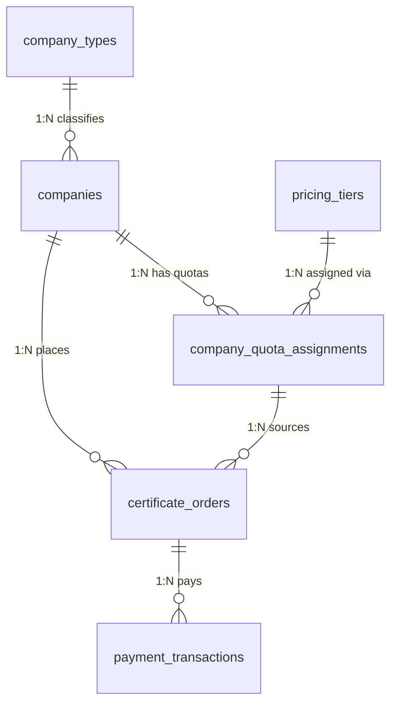

# Roadmap de Implementación y Arquitectura (Certificate Manager)

**Fecha:** 2026-05-04  
**Versión del Roadmap:** 1.1  
**Proyecto:** Certificate Manager (Backend / Laravel 10 / PHP 8.1)  
**Enfoque:** Deuda Técnica, Refactorización, Mejoras Arquitectónicas y Modelo de Negocio B2B  
**Metodología:** SCRUM (Sprints Iterativos de 2 semanas)  
**Principios Rectores:** SOLID, Clean Code, Patrones de Diseño (Service, Repository, DTO, Strategy).

Este roadmap está diseñado a partir del [Inventario de Funcionalidades](./2026-05-04_INVENTARIO_FUNCIONALIDADES_PENDIENTES.md) (v2.x) para elevar la calidad del código, reducir el acoplamiento y garantizar un entorno de desarrollo local óptimo.

---

## Convenciones del Documento

| Símbolo | Significado |
|---------|-------------|
| 🟢 | Sin dependencias, puede iniciarse inmediatamente |
| 🟡 | Depende de tareas de un Sprint anterior |
| 🔴 | Bloqueado por decisión externa (credenciales, stakeholders) |
| **SP** | Story Points (Fibonacci: 1, 2, 3, 5, 8, 13) |

**Definition of Done (Global):**
1. El código compila sin errores (`php artisan route:list` exitoso).
2. Los tests existentes (220+) siguen pasando al 100%.
3. Se agregan tests unitarios para la lógica nueva o refactorizada.
4. Se aplica `declare(strict_types=1)` en todo archivo nuevo o modificado.
5. Commit con formato *Conventional Commits* (`feat:`, `refactor:`, `fix:`).

> [!CAUTION]
> ### ⛔ Regla de Oro: Protección de Datos Productivos
> La base de datos de este proyecto **contiene datos reales de producción**. Está terminantemente prohibido ejecutar comandos masivos que puedan destruir o corromper la información existente.
>
> **NUNCA ejecutar:**
> ```bash
> php artisan migrate          # ❌ Ejecuta TODAS las migraciones pendientes
> php artisan db:seed           # ❌ Ejecuta TODOS los seeders (puede sobrescribir datos)
> php artisan migrate:fresh     # ❌ BORRA toda la BD y recrea desde cero
> php artisan migrate:refresh   # ❌ Hace rollback de todo y re-migra
> ```
>
> **SIEMPRE ejecutar migraciones INDIVIDUALMENTE con `--path`:**
> ```bash
> php artisan migrate --path=database/migrations/2026_XX_XX_NOMBRE_MIGRACION.php
> ```
>
> **SIEMPRE ejecutar seeders INDIVIDUALMENTE con `--class`:**
> ```bash
> php artisan db:seed --class=NombreDelSeederEspecifico
> ```
>
> Esta regla aplica tanto en el entorno local como en producción. No hay excepciones.

---

## 🎯 Sprint 1: Deuda Técnica y Clean Code (Refactorización Estructural)
**Objetivo:** Eliminar anti-patrones, fortalecer el tipado y aislar responsabilidades (SRP).  
**Capacidad estimada:** 13 SP  
**Dependencias:** 🟢 Ninguna (puede iniciarse de inmediato).

| ID | Tarea | Patrón / Principio | SP | Criterio de Aceptación |
|----|-------|--------------------|----|------------------------|
| **1.1** | **Refactorizar `CompanyController`** <br> Extraer la lógica de negocio de métodos estáticos hacia una clase `CompanyService` inyectable vía constructor. | **SRP** / **DI** | 5 | `CompanyController` no tiene métodos `static`. `CompanyService` está registrado en el Service Container. Tests de Feature del módulo Company pasan. |
| **1.2** | **Tipado Estricto en `HttpResponseMessages`** <br> Aplicar `declare(strict_types=1)`, *Return Types* obligatorios y migrar arrays asociativos hacia Enums de PHP 8.1 (`BackedEnum`). | **Clean Code** (Tipado) | 3 | La clase usa `enum` para códigos de respuesta. No existen `mixed` ni `array` sin tipar en sus firmas. Tests unitarios cubren cada método. |
| **1.3** | **Limpieza de Deuda Menor** <br> Resolver etiquetas `@todo` pendientes (`AppServiceProvider`, `AiContentService`, etc.), eliminar archivos temporales del repositorio y comentarios obsoletos. | **Clean Code** (Boy Scout) | 2 | `grep -r "TODO" app/` retorna 0 resultados relevantes. No existen archivos `.bak`, `.tmp` o copias de seguridad en el repo. |
| **1.4** | **Tests de Regresión Sprint 1** <br> Escribir tests unitarios para `CompanyService` y los nuevos Enums de `HttpResponseMessages`. | **Testing / Calidad** | 3 | Cobertura de `CompanyService` ≥ 90%. Cada valor del Enum tiene al menos un test. Suite completa pasa en verde. |

---

## 🏗️ Sprint 2: Evolución Arquitectónica y Patrones de Diseño
**Objetivo:** Estandarizar la comunicación entre capas y abstraer la persistencia del módulo v1.  
**Capacidad estimada:** 21 SP  
**Dependencias:** 🟡 Requiere Sprint 1 completado (el `CompanyService` debe existir antes de crear su Repository).

| ID | Tarea | Patrón / Principio | SP | Criterio de Aceptación |
|----|-------|--------------------|----|------------------------|
| **2.1** | **Consolidación del Repository Pattern** <br> Crear interfaces (`CertificateRequestRepositoryContract`, `CompanyRepositoryContract`) y sus implementaciones Eloquent. Registrar bindings en `AppServiceProvider`. | **Repository** / **DIP** | 8 | Ningún Controller ni Service del módulo v1 ejecuta queries Eloquent directamente (todo pasa por el Repository). Los bindings están en el Service Container. |
| **2.2** | **Implementación de DTOs en v1** <br> Crear DTOs inmutables (`CreateCertificateRequestDTO`, `UpdateCertificateRequestDTO`) para reemplazar el paso directo del objeto `Request` a la capa de Servicios. | **DTO** / **Contratos** | 8 | Ningún Service recibe `Illuminate\Http\Request` como parámetro. Los DTOs usan `readonly` properties. Los FormRequest mapean a DTOs en el Controller. |
| **2.3** | **Tests de Regresión Sprint 2** <br> Tests unitarios para cada Repository (mockeando Eloquent) y tests de integración validando los DTOs en el flujo completo de solicitud de certificado. | **Testing / Calidad** | 5 | Cobertura de Repositories ≥ 85%. El flujo `POST /api/certificate-requests` funciona end-to-end con DTOs. Suite completa pasa. |

---

## 🛡️ Sprint 3: Mantenimiento, Seguridad y Entorno Local
**Objetivo:** Estabilizar observabilidad, blindar comunicaciones y garantizar testing local equivalente a producción.  
**Capacidad estimada:** 8 SP  
**Dependencias:** 🟢 Independiente de Sprint 1-2 (puede ejecutarse en paralelo si hay capacidad).

| ID | Tarea | Patrón / Principio | SP | Criterio de Aceptación |
|----|-------|--------------------|----|------------------------|
| **3.1** | **Configuración Estricta de CORS** <br> Ajustar `config/cors.php` para restringir orígenes a la SPA (Matias APP) y dominios de clientes. Eliminar wildcard `*`. | **Security by Design** | 2 | `config/cors.php` no contiene `'*'` en `allowed_origins`. Un request desde un origen no listado retorna `403`. Test de Feature verifica el comportamiento. |
| **3.2** | **Rotación de Logs (`daily`)** <br> Cambiar canal de logs en `config/logging.php` a `daily` con retención de 30 días. | **Observabilidad** | 1 | `config/logging.php` tiene `'driver' => 'daily'` y `'days' => 30`. El archivo de log generado incluye la fecha en su nombre. |
| **3.3** | **Emulación Local de Cronjobs** <br> Documentar el uso de `php artisan schedule:work` y verificar que los comandos `WebhookCleanupCommand` y `WebhookRetryCommand` están registrados en `Kernel.php`. | **DevOps Local** | 2 | Existe un archivo `docs/GUIA_DESARROLLO_LOCAL.md`. Los 2 comandos aparecen en `php artisan schedule:list`. Un desarrollador nuevo puede seguir la guía sin asistencia. |
| **3.4** | **Auditoría de Seguridad de Dependencias** <br> Ejecutar `composer audit` y resolver vulnerabilidades conocidas en las dependencias del proyecto. | **Security by Design** | 3 | `composer audit` retorna 0 vulnerabilidades críticas o altas. Se documenta cualquier excepción aceptada. |

---

## 🧠 Sprint 4 (Opcional/Latente): Reactivación Inteligencia Artificial
**Objetivo:** Concluir y conectar los módulos de IA en estado de pausa.  
**Capacidad estimada:** 21 SP  
**Dependencias:** 🔴 Bloqueado por credenciales externas (Google Vision / Gemini API Keys).

| ID | Tarea | Patrón / Principio | SP | Criterio de Aceptación |
|----|-------|--------------------|----|------------------------|
| **4.1** | **Activación del Pipeline OCR** <br> Configurar credenciales en `.env`, descomentar la lógica en `OcrService`, conectar con `ProcessCertificateJob`. | **Adapter Pattern** | 5 | Un documento subido se procesa vía Job y el resultado OCR se guarda en BD. Test con mock del API externo pasa. |
| **4.2** | **Integración Gemini / AiContentService** <br> Activar el servicio de análisis de contenido con Gemini, diseñar la tabla `document_analysis_results` para persistir la analítica. | **Adapter Pattern** | 8 | El endpoint de análisis retorna un JSON estructurado. La migración `document_analysis_results` se ejecuta. Test con Fake de Gemini pasa. |
| **4.3** | **Panel de Analíticas IA (Endpoints)** <br> Crear endpoints para consultar los resultados de análisis por empresa, por tipo de documento y por fecha. | **Repository / DTO** | 5 | Endpoints `GET /api/v2/analytics/*` documentados en Swagger. Respuestas paginadas. Tests de Feature cubren los 3 filtros. |
| **4.4** | **Tests del Pipeline IA** <br> Tests unitarios con Fakes/Mocks para cada Adapter (Textract, Vision, Gemini) sin tocar APIs externas reales. | **Testing / Calidad** | 3 | Cobertura del módulo IA ≥ 80%. Ningún test hace llamadas HTTP reales. Suite completa pasa en verde. |

---

## 🔄 [SECCIÓN ABIERTA] — Sprint 5: Modelo de Negocio B2B

### 🚀 Pagos WOMPI, Tarifas Dinámicas y Cupos Corporativos
**Análisis de Arquitectura y Base de Datos (Basado en Reglas de Negocio 2026)**  
**Capacidad estimada:** 34 SP  
**Dependencias:** 🟡 Requiere Sprint 2 completado (Repository Pattern y DTOs necesarios para la capa de Servicios de pagos).

Tras analizar la base de datos actual (`certificate-manager-API.sql`), se identifica la necesidad de estructurar el modelo relacional para soportar las nuevas reglas de monetización y pasarela de pagos (Wompi).

#### Diseño del Modelo Relacional (Normalizado — 1NF, 2NF, 3NF)

> **Principio:** Cada tabla tiene una única responsabilidad. No se mezclan catálogos con datos transaccionales ni relaciones cruzadas. Las tablas auxiliares son agnósticas y reutilizables.



---

##### Tabla 1: `company_types` (Catálogo Puro — 3NF)
Tabla auxiliar de solo lectura. Define **qué tipo de empresa es**, sin mezclar datos de negocio.

| Campo | Tipo | Descripción |
|-------|------|-------------|
| `id` | PK AUTO | Identificador |
| `code` | VARCHAR(30) UNIQUE | Código interno (`API_DEVELOPER`, `PORTAL_ALLY`) |
| `name` | VARCHAR(100) | Nombre legible ("Desarrollador API / ERP", "Aliado Portal") |
| `description` | TEXT NULL | Descripción del tipo de empresa |
| `is_active` | BOOLEAN DEFAULT TRUE | Soft-delete lógico |

**Seeder:**

| code | name |
|------|------|
| `API_DEVELOPER` | Desarrollador API / ERP |
| `PORTAL_ALLY` | Aliado Portal (Cliente Directo) |

---

##### Tabla 2: `pricing_tiers` (Catálogo Puro — Agnóstico — 3NF)
Tabla agnóstica de rangos de precios. **No sabe a quién pertenece**, solo define rangos y valores. Cualquier entidad del sistema puede referenciarla.

| Campo | Tipo | Descripción |
|-------|------|-------------|
| `id` | PK AUTO | Identificador |
| `tier_name` | VARCHAR(50) | Nombre del rango ("RANGO_1", "RANGO_2", "RANGO_3") |
| `min_quantity` | INT UNSIGNED | Cantidad mínima que activa este rango |
| `max_quantity` | INT UNSIGNED NULL | Cantidad máxima (NULL = sin tope) |
| `validity_years` | SMALLINT UNSIGNED | Vigencia del certificado (1 o 2 años) |
| `unit_price` | DECIMAL(12,2) | Precio unitario en COP (IVA incluido) |
| `discount_percentage` | DECIMAL(5,2) DEFAULT 0 | Porcentaje de descuento vs. tarifa base |
| `is_active` | BOOLEAN DEFAULT TRUE | Activar/desactivar sin borrar |
| `created_at` | TIMESTAMP | Fecha de creación |
| `updated_at` | TIMESTAMP | Última modificación |

**Seeder (9 registros):**

| Rango | Cantidad | Vigencia | Precio | Descuento |
|-------|----------|----------|--------|-----------|
| RANGO_1 | 1 - 4 | 1 Año | $135.000 | 0% |
| RANGO_1 | 1 - 4 | 2 Años | $215.000 | 0% |
| RANGO_2 | 5 - 9 | 1 Año | $125.000 | ~7% |
| RANGO_2 | 5 - 9 | 2 Años | $200.000 | ~7% |
| RANGO_3 | 10+ | 1 Año | $115.000 | ~15% |
| RANGO_3 | 10+ | 2 Años | $185.000 | ~15% |
| RANGO_API_1 | 1 - 20 NITs | 1 Año | $120.000 | 0% |
| RANGO_API_2 | 21 - 100 NITs | 1 Año | $110.000 | ~8% |
| RANGO_API_3 | 101+ NITs | 1 Año | $101.000 | ~16% |

---

##### Tabla 3: ALTER `companies` (Solo FKs — 2NF)
Se agrega **únicamente** la relación hacia el catálogo de tipos. Los datos del tipo viven en `company_types`, no aquí.

| Campo Nuevo | Tipo | Descripción |
|-------------|------|-------------|
| `company_type_id` | FK → `company_types.id` | Tipo de empresa (obligatorio) |
| `is_postpaid` | BOOLEAN DEFAULT FALSE | ¿Tiene convenio de pago mes vencido? |
| `postpaid_credit_limit` | INT UNSIGNED DEFAULT 0 | Cuota máxima mensual (solo si `is_postpaid = true`) |

---

##### Tabla 4: `company_quota_assignments` (Tabla Pivote — Asignación de Rangos y Cupos)
Tabla de relación que conecta **una empresa** con **un rango de precios** y le asigna **la cuota de certificados**. Es el corazón del modelo de negocio.

| Campo | Tipo | Descripción |
|-------|------|-------------|
| `id` | PK AUTO | Identificador |
| `company_id` | FK → `companies.id` | Empresa a la que se le asigna el cupo |
| `pricing_tier_id` | FK → `pricing_tiers.id` | Rango de precios aplicado a esta empresa |
| `quota_type` | ENUM(`PREPAID`, `POSTPAID`) | Tipo de cupo: prepago (Wompi) o postpago (convenio) |
| `total_assigned` | INT UNSIGNED DEFAULT 0 | Certificados totales asignados (compra o admin) |
| `total_used` | INT UNSIGNED DEFAULT 0 | Certificados ya consumidos |
| `assigned_by` | FK → `users.id` NULL | Quién asignó el cupo (admin o sistema) |
| `assigned_at` | DATETIME | Fecha de asignación |
| `expires_at` | DATETIME NULL | Expiración del cupo (NULL = sin vencimiento) |
| `is_active` | BOOLEAN DEFAULT TRUE | Estado del cupo |
| `created_at` | TIMESTAMP | |
| `updated_at` | TIMESTAMP | |

**Lógica de negocio derivada:**
*   `available = total_assigned - total_used` (calculado en el Service, no en BD).
*   Si `available == 0` y `companies.is_postpaid == false` → HTTP `402 Payment Required`.
*   Si `companies.is_postpaid == true` → validar `total_used` mensual contra `postpaid_credit_limit`.

---

##### Tabla 5: `certificate_orders` (Transaccional — Intención de compra — Agnóstica de pasarela)

| Campo | Tipo | Descripción |
|-------|------|-------------|
| `id` | PK AUTO | Identificador |
| `company_id` | FK → `companies.id` | Empresa compradora |
| `pricing_tier_id` | FK → `pricing_tiers.id` | Tarifa aplicada (snapshot al momento del checkout) |
| `quantity` | INT UNSIGNED | Certificados solicitados |
| `validity_years` | SMALLINT UNSIGNED | Vigencia seleccionada |
| `unit_price_snapshot` | DECIMAL(12,2) | Precio unitario congelado al crear la orden (valor real en COP) |
| `total_amount` | DECIMAL(14,2) | Monto total en COP = quantity × unit_price_snapshot |
| `currency` | VARCHAR(3) DEFAULT 'COP' | Código ISO 4217 de la moneda |
| `status` | ENUM | `PENDING`, `PAID`, `FAILED`, `CANCELLED`, `REFUNDED` |
| `payment_provider` | VARCHAR(30) NULL | Proveedor usado (`WOMPI`, `BOLD`, `STRIPE`, etc.) |
| `provider_reference` | VARCHAR(150) NULL | Referencia externa de la transacción en el proveedor |
| `created_at` | TIMESTAMP | |
| `updated_at` | TIMESTAMP | |

---

##### Tabla 6: `payment_transactions` (Transaccional — Auditoría de pagos — Agnóstica de pasarela)

> **Principio:** Todos los montos se almacenan en **valor real** (COP con decimales). La conversión a centavos, unidades menores o cualquier formato específico del proveedor (Wompi, Bold, Stripe) se realiza **exclusivamente en la capa Adapter** al momento de comunicarse con la API externa.

| Campo | Tipo | Descripción |
|-------|------|-------------|
| `id` | PK AUTO | Identificador |
| `order_id` | FK → `certificate_orders.id` | Orden asociada |
| `payment_provider` | VARCHAR(30) | Proveedor (`WOMPI`, `BOLD`, `STRIPE`, etc.) |
| `provider_transaction_id` | VARCHAR(150) | ID único de la transacción en el proveedor |
| `provider_status` | VARCHAR(30) | Estado reportado por el proveedor (`APPROVED`, `DECLINED`, etc.) |
| `amount` | DECIMAL(14,2) | Monto real en COP (no centavos) |
| `currency` | VARCHAR(3) DEFAULT 'COP' | Código ISO 4217 |
| `payment_method` | VARCHAR(50) | Método de pago (PSE, tarjeta, Nequi, Daviplata, etc.) |
| `webhook_payload` | JSON NULL | Payload completo del Webhook para auditoría |
| `signature_valid` | BOOLEAN | Resultado de la validación de firma (HMAC, SHA, etc.) |
| `created_at` | TIMESTAMP | |

#### Tareas del Sprint 5

| ID | Tarea | Patrón / Principio | SP | Criterio de Aceptación |
|----|-------|--------------------|----|------------------------|
| **5.1** | **Migraciones de BD (6 tablas)** <br> Crear migraciones para: `company_types`, `pricing_tiers`, `ALTER companies` (FK + flags), `company_quota_assignments`, `certificate_orders`, `payment_transactions`. Crear Seeders para catálogos. | **Schema Design / 3NF** | 5 | `php artisan migrate` ejecuta sin errores. `php artisan db:seed` carga los 2 tipos de empresa y las 9 tarifas. Rollback funciona. Todas las FK tienen `ON DELETE` y `ON UPDATE` definidos. |
| **5.2** | **Modelos Eloquent y Relaciones** <br> Crear 5 Models nuevos (`CompanyType`, `PricingTier`, `CompanyQuotaAssignment`, `CertificateOrder`, `PaymentTransaction`). Modificar `Company` para agregar `belongsTo(CompanyType)` y `hasMany(CompanyQuotaAssignment)`. | **Active Record / ORM** | 3 | Cada Model tiene `$fillable`, `$casts`, relaciones y scopes. `Company::find(1)->companyType->code` retorna el tipo. Tinker navega toda la cadena relacional. |
| **5.3** | **`PricingService` (Strategy Pattern)** <br> Servicio que consulta `pricing_tiers` (tabla agnóstica) y calcula el precio dinámico según cantidad y vigencia. El tipo de empresa determina *qué rangos* se filtran via `company_quota_assignments`. | **Strategy / OCP** | 8 | Dado cantidad=7, vigencia=1 → retorna $125.000/u para rangos Portal. Dado NITs=50 → retorna $110.000/u para rangos API. Tests unitarios cubren todos los rangos y edge cases (cantidad en el límite exacto). |
| **5.4** | **`QuotaService` (Billetera)** <br> Servicio para: consultar saldo (`available`), consumir cupos atómicamente (DB Transaction + lock `FOR UPDATE`), y validar elegibilidad antes de emitir certificado. Diferenciar lógica PREPAID vs POSTPAID. | **Service / Transaction Script** | 5 | Consumir un cupo incrementa `total_used`. Intentar consumir con saldo 0 y `is_postpaid=false` lanza `InsufficientQuotaException`. Para postpago, valida contra `postpaid_credit_limit`. Operación atómica con rollback ante fallo. |
| **5.5** | **`PaymentGatewayContract` + Adapter WOMPI** <br> Crear interfaz `PaymentGatewayContract` con métodos `createPaymentIntent()`, `validateWebhook()`, `parseStatus()`. Implementar `WompiPaymentAdapter` que convierte montos COP → centavos solo al comunicarse con la API. Registrar binding en el Service Container. | **Adapter / DIP / OCP** | 8 | Cambiar de Wompi a otro proveedor requiere solo crear un nuevo Adapter e intercambiar el binding. Webhook con firma inválida retorna `401`. Webhook válido + `APPROVED` acredita cupos. Test con Fake pasa. |
| **5.6** | **Tests del Modelo B2B** <br> Tests unitarios para `PricingService`, `QuotaService` y `WompiPaymentAdapter` (verificando conversión COP ↔ centavos). Tests de Feature para el flujo completo: checkout → fake webhook → acreditación → consumo. | **Testing / Calidad** | 5 | Cobertura ≥ 85%. `$135.000 COP` se convierte a `13500000` centavos solo en el Adapter. Flujo end-to-end pasa. Ningún test toca APIs reales. |

---

## 📊 Resumen de Velocidad y Capacidad

| Sprint | Enfoque | Story Points | Dependencias |
|--------|---------|:------------:|:------------:|
| **Sprint 1** | Deuda Técnica / Clean Code | 13 SP | 🟢 Ninguna |
| **Sprint 2** | Arquitectura (Repository + DTO) | 21 SP | 🟡 Sprint 1 |
| **Sprint 3** | Seguridad / Observabilidad / Local | 8 SP | 🟢 Independiente |
| **Sprint 4** | IA (OCR / Gemini) — *Opcional* | 21 SP | 🔴 Credenciales |
| **Sprint 5** | Modelo B2B (WOMPI / Cupos) | 34 SP | 🟡 Sprint 2 |
| | **TOTAL** | **97 SP** | |

> **Nota:** Sprint 3 es independiente y puede ejecutarse en paralelo con Sprint 1 o 2 si hay capacidad en el equipo. Sprint 4 está bloqueado hasta que se resuelvan las credenciales de APIs externas.

---

## 📐 Diagrama de Dependencias

```
Sprint 1 (Clean Code) ──► Sprint 2 (Arquitectura) ──► Sprint 5 (B2B / WOMPI)
                                                          │
Sprint 3 (Seguridad) ─── [Independiente / Paralelo] ─────┘
                                                          
Sprint 4 (IA) ─── [Bloqueado por credenciales] ──────────►  Futuro
```
